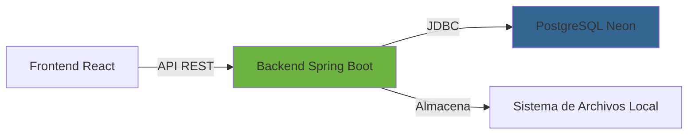
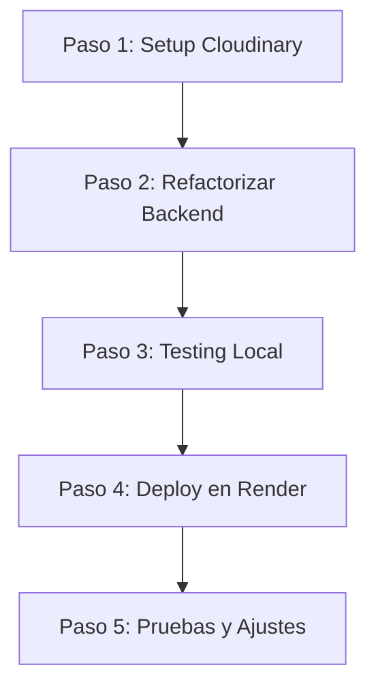

# 🎓 Guía de Despliegue - Reverso Social (Modo Formador)

## 📊 Arquitectura Actual de Tu Proyecto

### Stack Tecnológico Detectado



**Frontend:**
- React/Vite
- Desplegado: ✅ Netlify

**Base de Datos:**
- PostgreSQL (Neon)
- Servido a través de: ✅ Netlify

**Backend:**
- Spring Boot 3.4.12
- Java 21
- Almacenamiento: 📁 **Sistema de archivos local** (`uploads/`)
- Desplegar en: ❓ **A DECIDIR**

---

## 🎯 El Problema del Almacenamiento de Archivos

### 📝 Lección Teórica #1: Stateful vs Stateless

**¿Qué está pasando actualmente?**

Tu backend guarda las imágenes en el disco local usando esta clase:

```java
// FileStorageServiceImpl.java - Línea 17
private final Path uploadRoot = Paths.get("uploads").toAbsolutePath().normalize();
```

Esto crea una carpeta física en el servidor donde se ejecuta tu aplicación.

#### ❌ **Problema en Producción:**

Los servicios cloud **gratuitos** como Render, Railway, y Fly.io tienen **almacenamiento efímero**:

> 🔴 **Almacenamiento Efímero:** Los archivos guardados en el disco local se **borran** cuando:
> - El servidor se reinicia
> - Se despliega una nueva versión
> - El servicio "hiberna" por inactividad (planes gratuitos)
> - Se cambia la instancia del servidor

**Ejemplo real:**
1. Un usuario sube una foto de perfil → Se guarda en `/uploads/profiles/foto.jpg`
2. El servidor de Render se reinicia (esto pasa automáticamente cada 24h en el plan gratuito)
3. 💥 **¡La foto desaparece!**

### ✅ **Solución: Almacenamiento Persistente Externo**

Necesitas un servicio **dedicado** para archivos:
- ☁️ **Cloudinary** (imágenes y videos)
- 📦 Amazon S3
- 🌐 Supabase Storage
- Azure Blob Storage

---

## 🆚 Comparativa de Plataformas de Backend (2026)

### 1. **Render** ⭐⭐⭐⭐

**Plan Gratuito (Hobby):**
- ✅ 750 horas/mes por workspace
- ✅ PostgreSQL gratuito por 30 días (luego expira)
- ✅ Deploy automático desde GitHub
- ✅ Variables de entorno
- ✅ SSL automático
- ⚠️ **Almacenamiento efímero** (se borra con cada deploy)
- ⚠️ El servicio "hiberna" tras 15 min de inactividad
- ⚠️ Primer request después de hibernar: ~30 segundos

**Ideal para:** Proyectos pedagógicos, demos, prototipos

**Compatibilidad con Spring Boot:** ⭐⭐⭐⭐⭐ Excelente

### 2. **Railway** ⭐⭐⭐⭐

**Plan Gratuito:**
- ✅ $5 USD de crédito mensual (trial de 30 días)
- ✅ 0.5 GB RAM, 1 vCPU
- ✅ Deploy automático desde GitHub
- ✅ No requiere Dockerfile (detección automática)
- ✅ Variables de entorno
- ⚠️ **Almacenamiento efímero**
- ⚠️ Después del trial: **solo 500 horas/mes** (≈20 días)
- ⚠️ Se apaga si se agotan los $5

**Ideal para:** Testing, desarrollo, proyectos de corta duración

**Compatibilidad con Spring Boot:** ⭐⭐⭐⭐⭐ Excelente

### 3. **Fly.io** ⭐⭐

**Plan Gratuito:**
- ❌ **YA NO EXISTE** verdadero free tier desde 2024
- ⚠️ Trial: 2 horas VM o 7 días (lo que ocurra primero)
- ⚠️ VMs se apagan automáticamente después de 5 min
- ⚠️ Requiere tarjeta de crédito
- ✅ Facturas <$5 no se cobran

**Ideal para:** Proyectos comerciales con presupuesto

**Compatibilidad con Spring Boot:** ⭐⭐⭐⭐

---

## 💡 Mi Recomendación Profesional

### 🥇 **Opción 1: Render + Cloudinary** (LA MEJOR PARA TI)

**Por qué esta combinación:**

✅ **Render para Backend:**
- Más generoso (750h vs 500h de Railway)
- Configuración simple
- Documentación excelente
- Comunidad activa

✅ **Cloudinary para Imágenes:**
- **25 GB de almacenamiento gratis**
- **25 GB de ancho de banda/mes gratis**
- SDK oficial para Spring Boot
- Transformaciones de imagen automáticas
- URLs permanentes (no se borran)
- CDN global incluido (carga rápida en todo el mundo)

### 📊 Comparativa de Costos (Plan Gratuito)

| Servicio | Almacenamiento | Ancho de Banda | Transformaciones |
|----------|---------------|----------------|------------------|
| **Cloudinary** | 25 GB | 25 GB/mes | 25,000/mes |
| Supabase | 1 GB | 2 GB/mes | ❌ No incluye |
| Uploadcare | 3 GB | 10 GB/mes | 1,000/mes |

---

## 🎓 Lección Teórica #2: ¿Por qué Cloudinary?

### Arquitectura Actual vs Propuesta

#### **ANTES (Local Storage)** ❌
```
Usuario → Frontend → Backend → Disco Local (/uploads/)
                                    ↓ (se pierde al reiniciar)
```

#### **DESPUÉS (Cloudinary)** ✅
```
Usuario → Frontend → Backend → Cloudinary API → CDN Global
                                      ↓ (permanente)
                                 Base de Datos (guarda URL)
```

### Ventajas de Cloudinary:

1. **Persistencia Garantizada:** Los archivos nunca se borran
2. **CDN Global:** Imágenes se cargan desde el servidor más cercano al usuario
3. **Optimización Automática:** Convierte formatos, comprime, redimensiona
4. **URLs Transformables:** Puedes cambiar tamaño en la URL
   ```
   Original: https://res.cloudinary.com/demo/image/upload/sample.jpg
   Thumbnail: https://res.cloudinary.com/demo/image/upload/w_200,h_200,c_fill/sample.jpg
   ```
5. **Gestión desde Dashboard:** Panel web para ver/borrar archivos

---

## 📋 Plan de Implementación Sugerido

### **Fase 1: Preparar el Backend para Cloudinary** 📦

> 🎓 **Concepto:** Vamos a crear una **nueva implementación** del servicio de almacenamiento que use Cloudinary en lugar del disco local. Esto se llama el **patrón Strategy** en programación.

**Archivos a modificar/crear:**
1. `pom.xml` - Añadir dependencia de Cloudinary
2. `application.properties` - Añadir credenciales de Cloudinary
3. `CloudinaryConfig.java` - Configuración del servicio (NUEVO)
4. `CloudinaryStorageServiceImpl.java` - Implementación (NUEVO)
5. Modificar controladores para usar el nuevo servicio

**Beneficio educativo:**
- Aprenderás a integrar servicios externos (APIs)
- Comprenderás el patrón de diseño Strategy
- Practicarás configuración de variables de entorno

### **Fase 2: Configurar Render** 🚀

1. Crear cuenta en Render
2. Conectar repositorio de GitHub
3. Configurar variables de entorno
4. Configurar build commands
5. Deploy automático

### **Fase 3: Migración de Datos** 📊

Si ya tienes imágenes en desarrollo:
1. Subirlas manualmente a Cloudinary
2. Actualizar URLs en la base de datos
3. Eliminar carpeta `uploads/` del proyecto

---

## ⚠️ Alternativas (Solo si NO quieres usar Cloudinary)

### **Opción 2: Render + Supabase Storage**

**Pros:**
- Supabase tiene PostgreSQL + Storage incluido
- Podrías cambiar de Neon a Supabase completamente
- SDK para Java disponible

**Contras:**
- Solo 1 GB de almacenamiento (vs 25 GB de Cloudinary)
- Menos transformaciones de imagen
- Documentación menos madura para Spring Boot

### **Opción 3: Railway + Cloudinary**

**Pros:**
- Railway hace auto-detección (no necesitas Dockerfile)
- Deploy más rápido

**Contras:**
- Solo 500 horas/mes (vs 750 de Render)
- Después del trial de $5, puede costar dinero

---

## 🎯 Mi Recomendación Final

### Para tu proyecto pedagógico: **Render + Cloudinary**

**Razones:**

1. ✅ **Totalmente gratuito** para el nivel de tráfico esperado
2. ✅ **Fácil de transferir** a la asociación después
3. ✅ **Aprenderás tecnologías profesionales** usadas en producción real
4. ✅ **Escalable** si el proyecto crece
5. ✅ **Documentación abundante** para aprender
6. ✅ **No requiere tarjeta de crédito** (Render Hobby)

### Roadmap de Aprendizaje:


